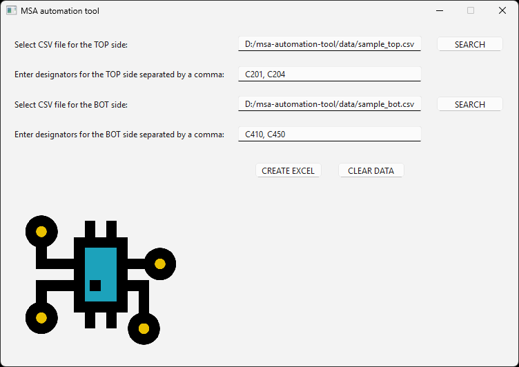

# MSA Automation Tool

## 📌 Overview

MSA Automation Tool is a Python desktop application designed to automate processing of raw data exported from AOI (Automated Optical Inspection) systems.

The tool transforms raw measurement data (CSV) into a structured Excel format used for Measurement Systems Analysis (MSA), reducing manual work, minimizing errors, and improving efficiency.

---

## ❗ Problem

Raw AOI measurement data requires manual filtering, sorting, and formatting before it can be used for MSA analysis.  
This process is repetitive, time-consuming, and prone to human error.

---

## ✅ Solution

MSA Automation Tool eliminates manual preprocessing by automatically transforming raw AOI data into a structured format ready for statistical analysis in Minitab.

---

## 🔄 Before vs After

**Before:**
- Manual data filtering in Excel  
- High risk of human error  
- Time-consuming repetitive work  

**After:**
- Automated data processing  
- Consistent and reliable output  
- Ready for MSA (ANOVA) in minutes  

---

## 🚀 Features

- Automated filtering of AOI data (TOP and BOT sides)
- Selection of specific component designators
- Filtering by ModuleID and Location Name
- Extraction of OffsetX and OffsetY measurements
- Automatic unit conversion (µm → mm)
- Generation of structured Excel output for MSA
- User-friendly desktop interface (PyQt6)

---

## ⚙️ How It Works

1. **Input data**
   - Raw AOI measurement data is stored in `.csv` files (TOP and/or BOT side)
   - User selects file paths or pastes them manually

2. **User input**
   - User provides component **designators** (e.g., R1, C5, U10)

3. **Processing**
   - Data is filtered, sorted, and converted to millimeters
   - Measurements are structured for MSA analysis

4. **Output**
   - Excel file (`MSA_data.xlsx`) with two tables

---

## 📊 Output Structure

### 1️⃣ MSA Data Table
- Contains processed measurement data
- Includes:
  - Operator
  - Part
  - X/Y offsets for each component

### 2️⃣ Tolerance Table
- Designator  
- Package (user-defined)  
- Tolerance X (user-defined)  
- Tolerance Y (user-defined)  

---

## 📈 Integration with Minitab

The generated Excel data can be directly copied into Minitab.

Workflow:
1. Copy processed data  
2. Paste into Minitab  
3. Run MSA using ANOVA  

---

## 🖼 Application Preview



---

## 📂 Project Structure

```text
msa-automation-tool/
│
├── main.py
├── gui.py
├── controller.py
├── excel_creator.py
│
├── data/
│ ├── sample_top.csv
│ └── sample_bot.csv
│
├── tests/
| └── test_excel_creator.py
|
├── chip-intelligence-processor.png
├── screenshot.png
├── requirements.txt
└── README.md
```
---

## ▶️ How to Run

### 1. Clone repository
```bash
git clone https://github.com/serhiintus/msa-automation-tool.git
cd msa-automation-tool
```
### 2. Create virtual environment
```bash
python -m venv venv
```
### 3. Activate
```bash
source venv/Scripts/activate
```
### 4. Install dependencies
```bash
pip install -r requirements.txt
```
### 5. Run
```bash
python main.py
```

---

## 🧪 Tests

Run tests with:

```bash
pytest
```

---

## 📊 Sample Data

sample_top.csv

sample_bot.csv

---

## 🧠 What I Learned

- Designing modular Python applications (GUI + logic separation)
- Working with real-world manufacturing data
- Automating engineering workflows
- Building user-oriented desktop tools

---

## 👨‍💻 Author

Serhii Provotorov

LinkedIn: https://www.linkedin.com/in/serhii-provotorov-5b621b1b1/